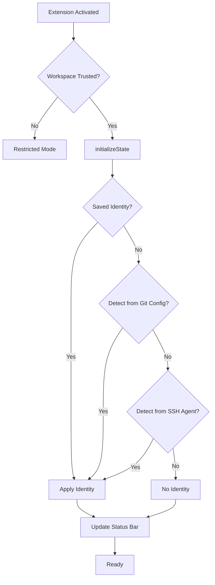

# nullvariant-vscode-extensions

[](https://github.com/nullvariant/nullvariant-vscode-extensions/actions/workflows/ci.yml)
[](https://github.com/nullvariant/nullvariant-vscode-extensions/actions/workflows/security.yml)
[](https://github.com/nullvariant/nullvariant-vscode-extensions/actions/workflows/ci.yml)
[](https://slsa.dev/)
[](https://github.com/nullvariant/nullvariant-vscode-extensions#supply-chain-security)
[](https://github.com/nullvariant/nullvariant-vscode-extensions#supply-chain-security)
[](https://securityscorecards.dev/viewer/?uri=github.com/nullvariant/nullvariant-vscode-extensions)
[](https://www.bestpractices.dev/projects/11709)
[](https://github.com/step-security/harden-runner)
[](https://github.com/Legit-Labs/legitify)
[](https://snyk.io/)
[](https://socket.dev/dashboard/org/null-variant/repo/nullvariant-vscode-extensions)
[](https://www.gitguardian.com/)
[](https://renovatebot.com)
[](https://app.fossa.com/projects/git%2Bgithub.com%2Fnullvariant%2Fnullvariant-vscode-extensions?ref=badge_shield&issueType=license)
[](https://app.fossa.com/projects/git%2Bgithub.com%2Fnullvariant%2Fnullvariant-vscode-extensions?ref=badge_shield&issueType=security)
[](https://codecov.io/gh/nullvariant/nullvariant-vscode-extensions)
[](https://sonarcloud.io/summary/new_code?id=nullvariant_nullvariant-vscode-extensions)
[](https://sonarcloud.io/summary/new_code?id=nullvariant_nullvariant-vscode-extensions)
[](https://sonarcloud.io/summary/new_code?id=nullvariant_nullvariant-vscode-extensions)
[](https://sonarcloud.io/summary/new_code?id=nullvariant_nullvariant-vscode-extensions)
[](https://sonarcloud.io/summary/new_code?id=nullvariant_nullvariant-vscode-extensions)

VS Code extensions by [Null;Variant](https://github.com/nullvariant).

## Extensions

### Git ID Switcher

<table>
  <tr>
    <td align="center" valign="top" width="150">
      
    </td>
    <td>
      Switch between multiple Git identities with one click. Manage multiple GitHub accounts, SSH keys, GPG signing, and <b>automatically apply identity to Git Submodules</b>.
      <br><br>
      <a href="https://open-vsx.org/extension/nullvariant/git-id-switcher"></a>
      <a href="https://opensource.org/licenses/MIT"></a>
      <a href="https://github.com/nullvariant/nullvariant-vscode-extensions/blob/main/extensions/git-id-switcher/docs/DESIGN_PHILOSOPHY.md"></a>
      <br>
      <a href="https://github.com/nullvariant/nullvariant-vscode-extensions/blob/main/extensions/git-id-switcher/docs/LANGUAGES.md"></a> <b>🇺🇸</b> <a href="https://github.com/nullvariant/nullvariant-vscode-extensions/blob/main/extensions/git-id-switcher/docs/i18n/ja/README.md">🇯🇵</a> <a href="https://github.com/nullvariant/nullvariant-vscode-extensions/blob/main/extensions/git-id-switcher/docs/i18n/zh-CN/README.md">🇨🇳</a> <a href="https://github.com/nullvariant/nullvariant-vscode-extensions/blob/main/extensions/git-id-switcher/docs/i18n/zh-TW/README.md">🇹🇼</a> <a href="https://github.com/nullvariant/nullvariant-vscode-extensions/blob/main/extensions/git-id-switcher/docs/i18n/ko/README.md">🇰🇷</a> <a href="https://github.com/nullvariant/nullvariant-vscode-extensions/blob/main/extensions/git-id-switcher/docs/i18n/de/README.md">🇩🇪</a> <a href="https://github.com/nullvariant/nullvariant-vscode-extensions/blob/main/extensions/git-id-switcher/docs/i18n/fr/README.md">🇫🇷</a> <a href="https://github.com/nullvariant/nullvariant-vscode-extensions/blob/main/extensions/git-id-switcher/docs/i18n/es/README.md">🇪🇸</a> <a href="https://github.com/nullvariant/nullvariant-vscode-extensions/blob/main/extensions/git-id-switcher/docs/i18n/pt-BR/README.md">🇧🇷</a> <a href="https://github.com/nullvariant/nullvariant-vscode-extensions/blob/main/extensions/git-id-switcher/docs/i18n/it/README.md">🇮🇹</a> <a href="https://github.com/nullvariant/nullvariant-vscode-extensions/blob/main/extensions/git-id-switcher/docs/i18n/ru/README.md">🇷🇺</a> <a href="https://github.com/nullvariant/nullvariant-vscode-extensions/blob/main/extensions/git-id-switcher/docs/i18n/pl/README.md">🇵🇱</a> <a href="https://github.com/nullvariant/nullvariant-vscode-extensions/blob/main/extensions/git-id-switcher/docs/i18n/tr/README.md">🇹🇷</a> <a href="https://github.com/nullvariant/nullvariant-vscode-extensions/blob/main/extensions/git-id-switcher/docs/i18n/cs/README.md">🇨🇿</a> <a href="https://github.com/nullvariant/nullvariant-vscode-extensions/blob/main/extensions/git-id-switcher/docs/i18n/hu/README.md">🇭🇺</a> <a href="https://github.com/nullvariant/nullvariant-vscode-extensions/blob/main/extensions/git-id-switcher/docs/i18n/bg/README.md">🇧🇬</a> <a href="https://github.com/nullvariant/nullvariant-vscode-extensions/blob/main/extensions/git-id-switcher/docs/i18n/uk/README.md">🇺🇦</a> <a href="https://github.com/nullvariant/nullvariant-vscode-extensions/blob/main/extensions/git-id-switcher/docs/i18n/eo/README.md">🌍</a> <a href="https://github.com/nullvariant/nullvariant-vscode-extensions/blob/main/extensions/git-id-switcher/docs/i18n/haw/README.md">🌺</a> <a href="https://github.com/nullvariant/nullvariant-vscode-extensions/blob/main/extensions/git-id-switcher/docs/i18n/ain/README.md">🐻</a> <a href="https://github.com/nullvariant/nullvariant-vscode-extensions/blob/main/extensions/git-id-switcher/docs/i18n/ryu/README.md">🐉</a> <a href="https://github.com/nullvariant/nullvariant-vscode-extensions/blob/main/extensions/git-id-switcher/docs/i18n/tok/README.md">✨</a> <a href="https://github.com/nullvariant/nullvariant-vscode-extensions/blob/main/extensions/git-id-switcher/docs/i18n/tlh/README.md">🖖</a> <a href="https://github.com/nullvariant/nullvariant-vscode-extensions/blob/main/extensions/git-id-switcher/docs/i18n/x-lolcat/README.md">🐱</a> <a href="https://github.com/nullvariant/nullvariant-vscode-extensions/blob/main/extensions/git-id-switcher/docs/i18n/x-pirate/README.md">🏴‍☠️</a> <a href="https://github.com/nullvariant/nullvariant-vscode-extensions/blob/main/extensions/git-id-switcher/docs/i18n/x-shakespeare/README.md">🎭</a>
      <br><br>
      <a href="extensions/git-id-switcher/#readme">📖 Documentation</a> | <a href="extensions/git-id-switcher/docs/ARCHITECTURE.md">🏗 Architecture</a> | <a href="extensions/git-id-switcher/docs/THREAT_MODEL.md">🛡 Threat Model</a> | <a href="extensions/git-id-switcher/docs/LANGUAGES.md">🌐 Languages</a> | <a href="extensions/git-id-switcher/docs/CONTRIBUTING.md">🤝 Contributing</a> | <a href="https://marketplace.visualstudio.com/items?itemName=nullvariant.git-id-switcher">📦 Marketplace</a> | <a href="https://open-vsx.org/extension/nullvariant/git-id-switcher">📦 Open VSX</a>
    </td>
  </tr>
</table>

<br>


## Quick Start for Developers

Get started in 5 steps:

```bash
# 1. Clone
git clone https://github.com/nullvariant/nullvariant-vscode-extensions.git
cd nullvariant-vscode-extensions

# 2. Install dependencies (from repository root)
npm install

# 3. Compile
npm run compile:all

# 4. Run tests
npm run test:all

# 5. Start watch mode for development
npm run watch:all
```

For linting: `npm run lint:all`

## Extension Initialization Flow



## Development

### Prerequisites

- Node.js 20+

### Working on an extension

```bash
cd extensions/git-id-switcher

# Install dependencies
npm install

# Compile
npm run compile

# Watch mode
npm run watch

# Package as VSIX
npm run package
```

### Testing locally

#### Manual Testing

1. Open the extension folder in VS Code
2. Press `F5` to launch Extension Development Host
3. Test the extension in the new window

#### Unit Tests

```bash
cd extensions/git-id-switcher
npm run test
```

#### E2E Tests

E2E tests run in an actual VS Code environment using `@vscode/test-electron`:

```bash
cd extensions/git-id-switcher
npm run test:e2e
```

> **Note**: On first run, VS Code will be downloaded automatically (~100MB). Subsequent runs use the cached version.

### Git Hooks Setup

This repository uses custom git hooks for release safety. After cloning, run:

```bash
git config core.hooksPath .githooks
```

This enables the pre-push hook that prevents pushing version bumps without release tags.

## Repository Structure

```
nullvariant-vscode-extensions/
├── extensions/
│   └── git-id-switcher/
├── .github/workflows/
│   ├── ci.yml
│   └── publish.yml
├── .githooks/
│   └── pre-push
├── LICENSE
└── README.md
```

## Publishing (Maintainers Only)

> **Note**: The `main` branch is protected. All changes must go through a Pull Request.

Extensions are automatically published when a release tag is pushed:

1. Ensure all changes are merged to `main` via Pull Request
2. Create and push a release tag from the latest `main`:

```bash
git checkout main
git pull origin main
git tag git-id-switcher-v1.0.0
git push origin git-id-switcher-v1.0.0
```

The [publish workflow](.github/workflows/publish.yml) will automatically build and publish the extension to VS Code Marketplace and Open VSX.

## Supply Chain Security

Every release includes cryptographic verification artifacts:

| Artifact              | Description                         |
| --------------------- | ----------------------------------- |
| `*.vsix`              | The extension package               |
| `*.vsix.intoto.jsonl` | SLSA Level 3 build provenance       |
| `*.vsix.bundle`       | Cosign keyless signature (Sigstore) |
| `sbom-cyclonedx.json` | CycloneDX SBOM with attestation     |

### Verify VSIX signature (Cosign)

```bash
# Download the VSIX and its .bundle from the GitHub Release, then:
cosign verify-blob git-id-switcher-<version>.vsix \
  --bundle git-id-switcher-<version>.vsix.bundle \
  --certificate-identity-regexp="https://github.com/nullvariant/nullvariant-vscode-extensions/" \
  --certificate-oidc-issuer="https://token.actions.githubusercontent.com"
```

### Verify SLSA provenance (GitHub CLI)

```bash
gh attestation verify git-id-switcher-<version>.vsix \
  --repo nullvariant/nullvariant-vscode-extensions
```

### Verify SBOM attestation (GitHub CLI)

```bash
gh attestation verify git-id-switcher-<version>.vsix \
  --repo nullvariant/nullvariant-vscode-extensions \
  --predicate-type https://cyclonedx.org/bom
```

## Extension Fingerprint

Use this information to verify you have the authentic Git ID Switcher extension:

| Field        | Value                                                                             |
| ------------ | --------------------------------------------------------------------------------- |
| Publisher    | `nullvariant`                                                                     |
| Extension ID | `nullvariant.git-id-switcher`                                                     |
| Repository   | `https://github.com/nullvariant/nullvariant-vscode-extensions`                    |
| Marketplace  | `https://marketplace.visualstudio.com/items?itemName=nullvariant.git-id-switcher` |
| Open VSX     | `https://open-vsx.org/extension/nullvariant/git-id-switcher`                      |

If you find an extension with a similar name from a different publisher, please report it (see [SECURITY.md](SECURITY.md#reporting-typosquatting)).

## See Also

- [GOVERNANCE.md](GOVERNANCE.md) — Project governance model
- [CODE_OF_CONDUCT.md](CODE_OF_CONDUCT.md) — Garden etiquette
- [CONTRIBUTING.md](CONTRIBUTING.md) — How to contribute
- [SECURITY.md](SECURITY.md) — Security policy and vulnerability reporting
- [AGENTS.md](AGENTS.md) — Constraints for AI-assisted contributions

## License

MIT
