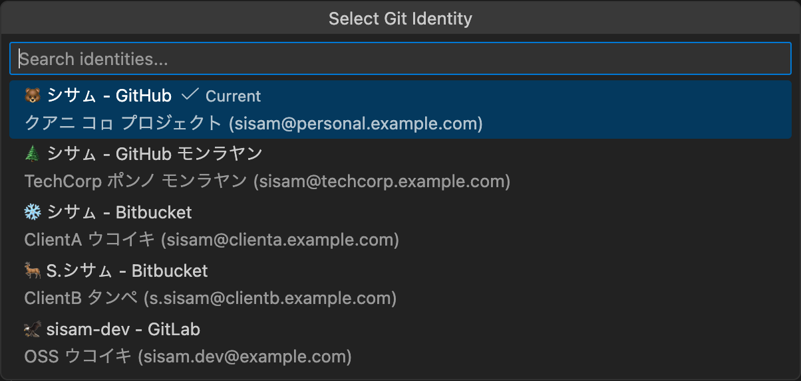

# Git ID Switcher

> **⚠️ アイヌ イタㇰ翻訳について**
>
> この翻訳は実験的なものであり、誤りを含む可能性があります。
> ネイティブスピーカーの方からの修正PRを心よりお待ちしています。
>
> タン ウコイタㇰ ウタㇻ オロワ コㇿカㇺ アン ルウェ ネ。
> ピㇼカ ウタㇻ オロワ アイヌ イタㇰ ウコイタㇰ エラマン クㇽ エアㇻキ。

---

## 📚 アイヌ イタㇰについて学ぶ / Learn More About Ainu

> アイヌ語（アイヌ イタㇰ）は、日本の北海道・樺太・千島列島で話されてきた言語です。現在はユネスコにより「極めて深刻な危機」に分類されていますが、復興の取り組みが進められています。

- [UNESCO Atlas of World's Languages in Danger](https://en.wal.unesco.org/)
- [アイヌ民族文化財団（公益財団法人）](https://www.frpac.or.jp/)
- [国立アイヌ民族博物館 ウポポイ](https://ainu-upopoy.jp/)
- [アイヌ語アーカイブ](https://ainugo.nam.go.jp/)
- [北海道立アイヌ民族文化研究センター](https://ainu-center.pref.hokkaido.jp/)

---

<table>
  <tr>
    <td align="center" valign="top" width="150">
      
    </td>
    <td>
      シネㇷ゚ クリㇰ オロワ Git ID ウコイタㇰ ウタㇻ ホㇱキノ エトゥㇾ。GitHub アカウント、SSH キー、GPG サイン オロワノ ウコイタㇰ、<b>Git Submodule オロワノ ID ウコイタㇰ</b>。
      <br><br>
      <a href="https://marketplace.visualstudio.com/items?itemName=nullvariant.git-id-switcher"></a>
      <a href="https://open-vsx.org/extension/nullvariant/git-id-switcher"></a>
      <a href="https://opensource.org/licenses/MIT"></a>
      <br>
      🌐 イタㇰ: <a href="../../../README.md">🇺🇸</a> <a href="../ja/README.md">🇯🇵</a> <a href="../zh-CN/README.md">🇨🇳</a> <a href="../zh-TW/README.md">🇹🇼</a> <a href="../ko/README.md">🇰🇷</a> <a href="../de/README.md">🇩🇪</a> <a href="../fr/README.md">🇫🇷</a> <a href="../es/README.md">🇪🇸</a> ... <a href="../../LANGUAGES.md">+20</a>
    </td>
  </tr>
</table>

<br>



## ピㇼカ ウタㇻ (Features / 機能)

- **シネㇷ゚ クリㇰ オロワ ID ウコイタㇰ**: Git user.name ウン user.email ホㇱキノ エトゥㇾ
- **SSH キー ウコイタㇰ**: ssh-agent オロワ SSH キー ウコイタㇰ
- **GPG サイン**: commit サイン GPG キー (オプション)
- **Submodule**: Git submodule オロワノ ID ウコイタㇰ
- **ステータスバー**: エネアン ID エヌカㇻ
- **ツールチップ**: ID ウタㇻ オロワ
- **macOS, Linux, Windows**: オㇿ ケウトゥㇺ
- **17 イタㇰ**: ウコイタㇰ ウタㇻ

## 🚀 ネーン クス タン Extension?

Git ID ウコイタㇰ Extension ポㇿ アン、**Git ID Switcher** ウタㇻ オㇿケ ピㇼカノ:

1. **Submodule**: submodule アン repository オロワ、シネㇷ゚ シネㇷ゚ `git config user.name` エキ クス ネ。タン extension オロワ submodule オㇿ ID ウコイタㇰ。
2. **SSH & GPG**: レー エトゥㇾ アイヌ、SSH キー ウン GPG サイン エキ。

## 🌏 イタㇰ ウタㇻ オロワ

> **ポン ウタㇻ オロワノ ピㇼカ アン。**
> ポンノ アン クス ホㇱキ エヤㇺ シㇼ ソモ キ。
> ピㇼカノ ウコイタㇰ エアㇻキ シㇼ ソモ ネ ヤㇰカ、ポン イタㇰ オロワ ピㇼカノ エヌカㇻ クス エラㇺ。

タン extension オロワ VSCode 17 イタㇰ オㇿ。README オロワ、ポン イタㇰ ウン ホㇱキㇷ゚ イタㇰ オロワノ。

---

## ホㇱキノ (Quick Start / クイックスタート)

### 1: SSH キー

```bash
# ウタㇻ (Personal / 個人用)
ssh-keygen -t ed25519 -C "kamuy@personal.example.com" -f ~/.ssh/id_ed25519_personal

# モノレ (Work / 仕事用)
ssh-keygen -t ed25519 -C "kamuy@company.example.com" -f ~/.ssh/id_ed25519_work
```

### 2: SSH Config

`~/.ssh/config` エトゥㇾ:

```ssh-config
# ウタㇻ アカウント
Host github.com
    HostName github.com
    User git
    IdentityFile ~/.ssh/id_ed25519_personal
    IdentitiesOnly yes

# モノレ アカウント
Host github-work
    HostName github.com
    User git
    IdentityFile ~/.ssh/id_ed25519_work
    IdentitiesOnly yes
```

### 3: Extension

```json
{
  "gitIdSwitcher.identities": [
    {
      "id": "personal",
      "icon": "🏠",
      "name": "カムイ レㇻ",
      "email": "kamuy@personal.example.com",
      "description": "ウタㇻ プロジェクト",
      "sshKeyPath": "~/.ssh/id_ed25519_personal"
    },
    {
      "id": "work",
      "icon": "💼",
      "name": "カムイ レㇻ",
      "email": "kamuy@company.example.com",
      "description": "モノレ",
      "sshKeyPath": "~/.ssh/id_ed25519_work",
      "sshHost": "github-work"
    }
  ],
  "gitIdSwitcher.defaultIdentity": "personal",
  "gitIdSwitcher.autoSwitchSshKey": true,
  "gitIdSwitcher.applyToSubmodules": true
}
```

### 4: エキ!

1. ステータスバー ID アイコン クリㇰ
2. ID エトゥㇾ
3. オㇿケ! Git config ウン SSH キー ウコイタㇰ。

---

## コマンド

| コマンド                        | ウコイタㇰ                     |
| ------------------------------- | ------------------------------ |
| `Git ID: Select Identity`       | ID ピッカー                    |
| `Git ID: Show Current Identity` | エネアン ID エヌカㇻ           |

---

## Contributing

[CONTRIBUTING.md](../../CONTRIBUTING.md) エヌカㇻ。

## License

MIT License - [LICENSE](../../LICENSE) エヌカㇻ。

## Credits

[Null;Variant](https://github.com/nullvariant) オロワ

---

🐻 **イヤイライケレ!** 🐻
