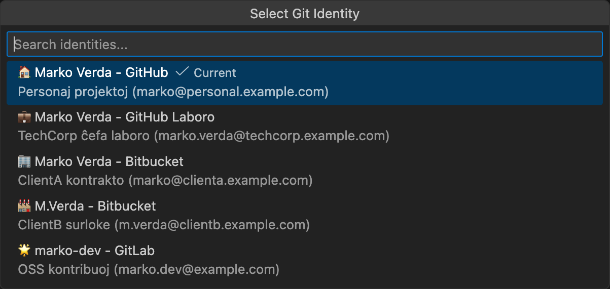

# Git ID Switcher 🌍

> **Esperanto** estas internacia lingvo kreita en 1887 de L. L. Zamenhof.
> Ĝia celo estas faciligi komunikadon inter homoj de diversaj landoj.

---

<table>
  <tr>
    <td align="center" width="150">
      
    </td>
    <td>
      Ŝanĝu inter pluraj Git-identecoj per unu klako. Administru plurajn GitHub-kontojn, SSH-ŝlosilojn, GPG-subskribon, kaj <b>aŭtomate apliku identecon al Git-submoduloj</b>.
      <br><br>
      <a href="https://marketplace.visualstudio.com/items?itemName=nullvariant.git-id-switcher"></a>
      <a href="https://open-vsx.org/extension/nullvariant/git-id-switcher"></a>
      <a href="https://opensource.org/licenses/MIT"></a>
      <br>
      🌐 Lingvoj: <a href="../../../README.md">🇺🇸</a> <a href="../ja/README.md">🇯🇵</a> <a href="../zh-CN/README.md">🇨🇳</a> <a href="../zh-TW/README.md">🇹🇼</a> <a href="../ko/README.md">🇰🇷</a> <a href="../de/README.md">🇩🇪</a> <a href="../fr/README.md">🇫🇷</a> <a href="../es/README.md">🇪🇸</a> ... <a href="../../LANGUAGES.md">+20 pli</a>
    </td>
  </tr>
</table>

<br>



## Funkcioj

- **Unu-klaka Identeco-Ŝanĝo**: Ŝanĝu vian Git user.name kaj user.email tuj
- **SSH-Ŝlosila Administrado**: Aŭtomate ŝanĝu SSH-ŝlosilojn en ssh-agent
- **GPG-Subskriba Subteno**: Agordu vian GPG-ŝlosilon por commit-subskribo (laŭvola)
- **Submodula Subteno**: Aŭtomate disvastigu vian identecon al Git-submoduloj
- **Statusbreto-Integriĝo**: Ĉiam vidu vian nunan identecon per unu rigardo
- **Riĉaj Konsiletoj**: Detalaj identeco-informoj kun priskribo kaj SSH-gastigo
- **Plurplatforma**: Funkcias sur macOS, Linux, kaj Windows
- **Lokalizita**: Subtenas 17 lingvojn

## 🚀 Kial Ĉi Tiu Etendo?

Kvankam multaj Git-identeco-ŝanĝiloj ekzistas, **Git ID Switcher** solvas la kompleksajn problemojn kiujn aliaj ignoras:

1. **Submodula Koŝmaro**: Laborante kun deponejoj havantaj submodulojn, oni kutime devas mane agordi `git config user.name` por *ĉiu* submodulo. Ĉi tiu etendo traktas ĝin elegante, rekursie aplikante vian identecon al ĉiuj aktivaj submoduloj.
2. **SSH & GPG Traktado**: Ĝi ne nur ŝanĝas vian nomon; ĝi interŝanĝas viajn SSH-ŝlosilojn en la agento kaj agordas GPG-subskribon, por ke vi neniam faru commit kun malĝusta subskribo.

## 🌏 Noto pri Plurlingva Subteno

> **Mi valoras la ekziston de minoritatoj.**
> Mi ne volas forĵeti ilin nur ĉar ili estas malmultaj.
> Eĉ se tradukoj ne estas perfektaj, mi esperas ke vi povas senti nian intencon montri respekton.

Esperanto mem naskiĝis el la ideo de lingva egaleco—ke ĉiu homo meritas voĉon, sendepende de sia denaska lingvo. Ĉi tiu etendo portas la saman spiriton.

---

## Rapida Komenco

### Paŝo 1: Preparu Viajn SSH-Ŝlosilojn

```bash
# Persona konto
ssh-keygen -t ed25519 -C "zamenhof@persona.example.com" -f ~/.ssh/id_ed25519_persona

# Labora konto
ssh-keygen -t ed25519 -C "zamenhof@laboro.example.com" -f ~/.ssh/id_ed25519_laboro
```

### Paŝo 2: Agordu SSH

Redaktu `~/.ssh/config`:

```ssh-config
# Persona Konto
Host github.com
    HostName github.com
    User git
    IdentityFile ~/.ssh/id_ed25519_persona
    IdentitiesOnly yes

# Labora Konto
Host github-laboro
    HostName github.com
    User git
    IdentityFile ~/.ssh/id_ed25519_laboro
    IdentitiesOnly yes
```

### Paŝo 3: Agordu la Etendon

```json
{
  "gitIdSwitcher.identities": [
    {
      "id": "persona",
      "icon": "🏠",
      "name": "Ludoviko Zamenhof",
      "email": "zamenhof@persona.example.com",
      "description": "Personaj projektoj",
      "sshKeyPath": "~/.ssh/id_ed25519_persona"
    },
    {
      "id": "laboro",
      "icon": "💼",
      "name": "Ludoviko Zamenhof",
      "email": "zamenhof@laboro.example.com",
      "description": "Labora evoluo",
      "sshKeyPath": "~/.ssh/id_ed25519_laboro",
      "sshHost": "github-laboro"
    },
    {
      "id": "esperantisto",
      "icon": "🌍",
      "name": "Esperantisto",
      "email": "esperantisto@mondo.example.com",
      "description": "Esperanto-komunumo projektoj"
    },
    {
      "id": "malferma-fonto",
      "icon": "🌟",
      "name": "Open Source Dev",
      "email": "dev@opensource.example.com",
      "description": "Malfermfontaj kontribuoj"
    }
  ],
  "gitIdSwitcher.defaultIdentity": "persona",
  "gitIdSwitcher.autoSwitchSshKey": true,
  "gitIdSwitcher.applyToSubmodules": true
}
```

### Paŝo 4: Uzu!

1. Klaku la identeco-ikonon en la statusbreto
2. Elektu vian identecon
3. Farite! Via Git-agordo kaj SSH-ŝlosiloj estas ŝanĝitaj.

---

## Pri Esperanto 📚

| Esperanto | English | Priskribo |
|-----------|---------|-----------|
| Saluton! | Hello! | Ĝenerala saluto |
| Dankon! | Thank you! | Esprimi dankon |
| Bonvolu | Please | Ĝentile peti |
| Ĝis revido | Goodbye | Ĝis ni renkontiĝos denove |

### Lerni Esperanton

- [Lernu.net](https://lernu.net/) - Senpaga Esperanto-lernejo
- [Duolingo Esperanto](https://www.duolingo.com/course/eo/en/Learn-Esperanto)
- [Vikipedio en Esperanto](https://eo.wikipedia.org/)

---

## Komandoj

| Komando                         | Priskribo                      |
| ------------------------------- | ------------------------------ |
| `Git ID: Select Identity`       | Malfermu la identeco-elektilon |
| `Git ID: Show Current Identity` | Montru nunan identeco-informon |

---

## Kontribuado

Ni bonvenigas kontribuojn! Vidu [CONTRIBUTING.md](../../CONTRIBUTING.md).

## Permesilo

MIT-Permesilo - Vidu [LICENSE](../../LICENSE).

## Kreditoj

Kreita de [Null;Variant](https://github.com/nullvariant)

---

🌍 **La espero - La mondo apartenas al ĉiuj!** 🌍

*(Hope - The world belongs to everyone!)*
