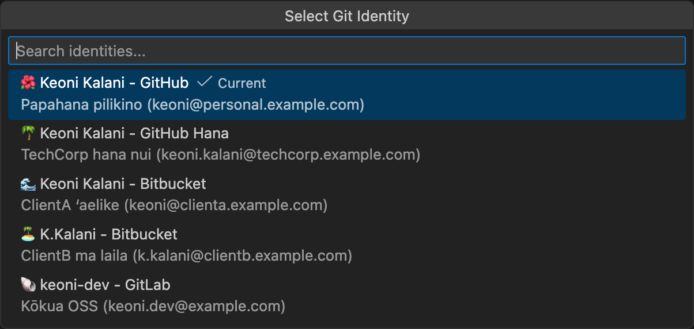

# Git ID Switcher

> **⚠️ ʻŌlelo Hawaiʻi Translation Notice / He Hoʻomaopopo**
>
> This translation is experimental and may contain errors.
> Native speakers are warmly invited to submit corrections via PR.
>
> He hoʻāʻo kēia unuhi a hiki ke loaʻa nā hewa.
> E ʻoluʻolu, e hoʻouna mai i nā hoʻoponopono ma o ka PR.

---

## 📚 E Aʻo Hou e Pili ana i ka ʻŌlelo Hawaiʻi / Learn More About Hawaiian

> Hawaiian (ʻŌlelo Hawaiʻi) is an endangered Polynesian language native to Hawaiʻi. Once nearly extinct, it has experienced a remarkable revival through immersion schools and community efforts.

- [UNESCO Atlas of World's Languages in Danger](https://en.wal.unesco.org/)
- [ʻAha Pūnana Leo - Hawaiian Language Immersion](https://www.ahapunanaleo.org/)
- [Duolingo Hawaiian Course](https://www.duolingo.com/course/haw/en/Learn-Hawaiian)
- [Ulukau - Hawaiian Electronic Library](https://ulukau.org/)

---

<table>
  <tr>
    <td align="center" width="150">
      
    </td>
    <td>
      E hoʻololi i nā ID Git he nui me ke kaomi hoʻokahi. E hoʻoponopono i nā moʻokāki GitHub he nui, nā kī SSH, ke kākau inoa GPG, a <b>hoʻopili ʻia ka ID i nā Git Submodule</b>.
      <br><br>
      <a href="https://marketplace.visualstudio.com/items?itemName=nullvariant.git-id-switcher"></a>
      <a href="https://open-vsx.org/extension/nullvariant/git-id-switcher"></a>
      <a href="https://opensource.org/licenses/MIT"></a>
      <br>
      🌐 Nā ʻŌlelo: <a href="../../../README.md">🇺🇸</a> <a href="../ja/README.md">🇯🇵</a> <a href="../zh-CN/README.md">🇨🇳</a> <a href="../zh-TW/README.md">🇹🇼</a> <a href="../ko/README.md">🇰🇷</a> <a href="../de/README.md">🇩🇪</a> <a href="../fr/README.md">🇫🇷</a> <a href="../es/README.md">🇪🇸</a> ... <a href="../../LANGUAGES.md">+20 hou aku</a>
    </td>
  </tr>
</table>

<br>



## Nā Hiʻohiʻona (Features)

- **Hoʻololi ID me ke Kaomi Hoʻokahi**: E hoʻololi i ka Git user.name a me user.email me ka wikiwiki
- **Hoʻoponopono Kī SSH**: E hoʻololi ʻia nā kī SSH ma ka ssh-agent
- **Kākoʻo GPG**: E hoʻonohonoho i ke kī GPG no ke kākau inoa commit (koho)
- **Kākoʻo Submodule**: E hoʻopili ʻia ka ID i nā Git submodule
- **Pahu Status**: E ʻike mau i kou ID i kēia manawa
- **Nā Tooltip Nui**: Nā ʻike kikoʻī e pili ana i ka ID
- **Nā Kahua Āpau**: Hana ma macOS, Linux, a me Windows
- **Nā ʻŌlelo He Nui**: Kākoʻo i 17 ʻōlelo

## 🚀 No ke aha kēia Extension?

ʻOiai he nui nā mea hoʻololi ID Git, hoʻoponopono ʻo **Git ID Switcher** i nā pilikia paʻakikī:

1. **Pilikia Submodule**: I ka hana ʻana me nā repository me nā submodule, pono e hoʻonohonoho lima i ka `git config user.name` no *kēlā me kēia* submodule. Hoʻoponopono kēia extension i kēia pilikia ma ka hoʻopili ʻana i ka ID i nā submodule āpau.
2. **SSH & GPG**: ʻAʻole wale e hoʻololi i ka inoa; e hoʻololi i nā kī SSH ma ka agent a hoʻonohonoho i ke kākau inoa GPG.

## 🌏 Ka Manaʻo e Pili ana i nā ʻŌlelo He Nui

> **Hoʻomanaʻo wau i ka waiwai o nā poʻe liʻiliʻi.**
> ʻAʻole makemake wau e haʻalele iā lākou no ka mea he liʻiliʻi.
> ʻOiai ʻaʻole hiki ke unuhi hemolele, manaʻolana wau e hoʻomaopopo ʻoukou i koʻu manaʻo e hoʻomaikaʻi a hoʻohanohano i nā ʻōlelo liʻiliʻi.

Kākoʻo kēia extension i nā ʻōlelo 17 āpau a VSCode e kākoʻo ai. Eia kekahi, no ka palapala README, hoʻāʻo mākou e unuhi i nā ʻōlelo liʻiliʻi a me nā ʻōlelo hoʻomākeʻaka.

ʻAʻole kēia he "kākoʻo honua" wale nō - ʻo ia ka "hoʻohanohano i ka ʻokoʻa o nā ʻōlelo."

---

## Hoʻomaka Wikiwiki (Quick Start)

### Pae 1: E Hoʻomākaukau i nā Kī SSH

```bash
# Pilikino (Personal)
ssh-keygen -t ed25519 -C "keola@personal.example.com" -f ~/.ssh/id_ed25519_personal

# Hana (Work)
ssh-keygen -t ed25519 -C "keola@company.example.com" -f ~/.ssh/id_ed25519_work
```

### Pae 2: E Hoʻonohonoho i ka SSH Config

E hoʻoponopono i `~/.ssh/config`:

```ssh-config
# Moʻokāki Pilikino
Host github.com
    HostName github.com
    User git
    IdentityFile ~/.ssh/id_ed25519_personal
    IdentitiesOnly yes

# Moʻokāki Hana
Host github-work
    HostName github.com
    User git
    IdentityFile ~/.ssh/id_ed25519_work
    IdentitiesOnly yes
```

### Pae 3: E Hoʻonohonoho i ka Extension

```json
{
  "gitIdSwitcher.identities": [
    {
      "id": "personal",
      "icon": "🏠",
      "name": "Keola Mahina",
      "email": "keola@personal.example.com",
      "description": "Nā papahana pilikino",
      "sshKeyPath": "~/.ssh/id_ed25519_personal"
    },
    {
      "id": "work",
      "icon": "💼",
      "name": "Keola Mahina",
      "email": "keola@company.example.com",
      "description": "Hana hui",
      "sshKeyPath": "~/.ssh/id_ed25519_work",
      "sshHost": "github-work"
    }
  ],
  "gitIdSwitcher.defaultIdentity": "personal",
  "gitIdSwitcher.autoSwitchSshKey": true,
  "gitIdSwitcher.applyToSubmodules": true
}
```

### Pae 4: E Hoʻohana!

1. E kaomi i ka icon ID ma ka pahu status
2. E koho i ka ID
3. Pau! Ua hoʻololi ʻia ka Git config a me ke kī SSH.

---

## Nā Kauoha (Commands)

| Kauoha                          | Wehewehe                       |
| ------------------------------- | ------------------------------ |
| `Git ID: Select Identity`       | E wehe i ka mea koho ID        |
| `Git ID: Show Current Identity` | E hōʻike i ka ID o kēia manawa |

---

## Kōkua (Contributing)

E ʻoluʻolu e nānā i [CONTRIBUTING.md](../../CONTRIBUTING.md).

## Laikini (License)

MIT License - E nānā i [LICENSE](../../LICENSE).

## Nā Hōʻoia (Credits)

Hana ʻia e [Null;Variant](https://github.com/nullvariant)

---

🌺 **Mahalo nui loa!** 🌺
