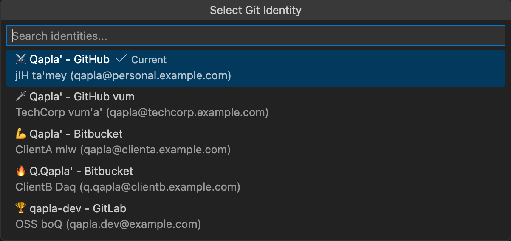

# Git ID Switcher 🖖

> **Qapla'!** tlhIngan Hol jatlhlaH'a'? DaH Git ID choHlaH!
>
> (Success! Can you speak Klingon? Now you can switch Git ID!)

---

<table>
  <tr>
    <td align="center" valign="top" width="150">
      
    </td>
    <td>
      wa' weQ neH lo'taHvIS Git ID law' choHlaH. GitHub accounts law', SSH keys, GPG signing, <b>Git Submodules automatic ID apply</b>.
      <br><br>
      <a href="https://marketplace.visualstudio.com/items?itemName=nullvariant.git-id-switcher"></a>
      <a href="https://open-vsx.org/extension/nullvariant/git-id-switcher"></a>
      <a href="https://opensource.org/licenses/MIT"></a>
      <br>
      🌐 Hol: <a href="../../../README.md">🇺🇸</a> <a href="../ja/README.md">🇯🇵</a> <a href="../zh-CN/README.md">🇨🇳</a> <a href="../zh-TW/README.md">🇹🇼</a> <a href="../ko/README.md">🇰🇷</a> <a href="../de/README.md">🇩🇪</a> <a href="../fr/README.md">🇫🇷</a> <a href="../es/README.md">🇪🇸</a> ... <a href="../../LANGUAGES.md">+20 latlh</a>
    </td>
  </tr>
</table>

<br>



## Features (ngoQ)

- **wa' weQ ID choH**: Git user.name, user.email nom choHlaH
- **SSH Key Management**: ssh-agent SSH keys automatic choH
- **GPG Signing Support**: GPG key commit signing configure (optional)
- **Submodule Support**: Git submodules ID automatic propagate
- **Status Bar Integration**: DaH ID leghlaH
- **Rich Tooltips**: ID details, description, SSH host
- **Cross-Platform**: macOS, Linux, Windows - Hoch platforms!
- **Localized**: 17 Hol support

## 🚀 qatlh extension?

Git ID switchers law' tu'lu', 'ach **Git ID Switcher** qay' potlh solve:

1. **Submodules qay'**: Submodules repository work, `git config user.name` *Hoch* submodule manually set need. extension Hoch active submodules ID recursively apply.
2. **SSH & GPG**: pong neH choH. ssh-agent SSH keys swap, GPG signing configure. wrong signature commit never!

## 🌏 Multilingual Support

> **minorities value jIH.**
> puS neH chaH 'e' vIHar pagh.
> translations perfect pagh, 'ach respect show intent feel DaneH.

---

## Quick Start

### Step 1: SSH Keys prepare

```bash
# warrior (personal)
ssh-keygen -t ed25519 -C "worf@warrior.example.com" -f ~/.ssh/id_ed25519_warrior

# captain (work)
ssh-keygen -t ed25519 -C "martok@captain.example.com" -f ~/.ssh/id_ed25519_captain
```

### Step 2: SSH Config

`~/.ssh/config` edit:

```ssh-config
# Warrior Account
Host github.com
    HostName github.com
    User git
    IdentityFile ~/.ssh/id_ed25519_warrior
    IdentitiesOnly yes

# Captain Account
Host github-captain
    HostName github.com
    User git
    IdentityFile ~/.ssh/id_ed25519_captain
    IdentitiesOnly yes
```

### Step 3: Extension Configure

```json
{
  "gitIdSwitcher.identities": [
    {
      "id": "warrior",
      "icon": "⚔️",
      "name": "Worf, Son of Mogh",
      "email": "worf@warrior.example.com",
      "description": "batlh (honor) projects",
      "sshKeyPath": "~/.ssh/id_ed25519_warrior"
    },
    {
      "id": "captain",
      "icon": "🖖",
      "name": "General Martok",
      "email": "martok@captain.example.com",
      "description": "Fleet command",
      "sshKeyPath": "~/.ssh/id_ed25519_captain",
      "sshHost": "github-captain"
    },
    {
      "id": "chancellor",
      "icon": "👑",
      "name": "Chancellor Gowron",
      "email": "gowron@highcouncil.example.com",
      "description": "High Council affairs"
    },
    {
      "id": "spy",
      "icon": "🎭",
      "name": "Operative",
      "email": "spy@intelligence.example.com",
      "description": "Covert operations"
    }
  ],
  "gitIdSwitcher.defaultIdentity": "warrior",
  "gitIdSwitcher.autoSwitchSshKey": true,
  "gitIdSwitcher.applyToSubmodules": true
}
```

### Step 4: Qapla'!

1. Status bar ID icon click
2. ID select
3. Qapla'! Git config, SSH keys switched!

---

## tlhIngan Hol Quick Reference

| tlhIngan | English | Usage |
|----------|---------|-------|
| Qapla' | Success! | Greeting/farewell |
| batlh | Honor | With honor |
| Heghlu'meH QaQ jajvam | Today is a good day to die | Before battle (or deployment) |
| nuqneH | What do you want? | Hello |
| HIja' / ghobe' | Yes / No | Responses |

---

## Commands (ra')

| Command                         | Description              |
| ------------------------------- | ------------------------ |
| `Git ID: Select Identity`       | ID picker open           |
| `Git ID: Show Current Identity` | DaH ID show              |

---

## Contributing

Contributions welcome! [CONTRIBUTING.md](../../CONTRIBUTING.md) yIlaD.

## License

MIT License - [LICENSE](../../LICENSE) yIlaD.

## Credits

[Null;Variant](https://github.com/nullvariant) chenmoH

---

🖖 **Qapla'! batlh Daqawlu'taH!** 🖖

*(Success! You will be remembered with honor!)*
