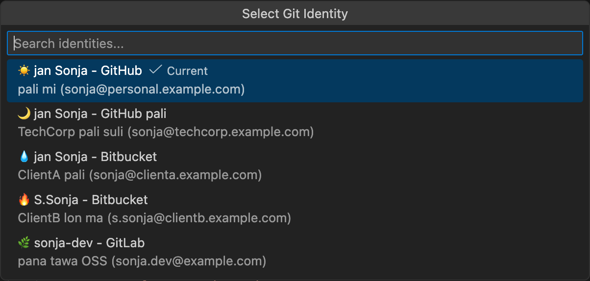

# Git ID Switcher ✨

> **toki pona** li toki lili. ona li jo e nimi 120 taso.
>
> (Toki Pona is a minimalist language. It has only about 120 words.)

---

<table>
  <tr>
    <td align="center" width="150">
      
    </td>
    <td>
      sina ken ante e nimi sina lon Git. luka wan la, sina ante e nimi. ilo ni li pona tawa GitHub mute, SSH, GPG, en <b>Git Submodule</b>.
      <br><br>
      <a href="https://marketplace.visualstudio.com/items?itemName=nullvariant.git-id-switcher"></a>
      <a href="https://open-vsx.org/extension/nullvariant/git-id-switcher"></a>
      <a href="https://opensource.org/licenses/MIT"></a>
      <br>
      🌐 toki: <a href="../../../README.md">🇺🇸</a> <a href="../ja/README.md">🇯🇵</a> <a href="../zh-CN/README.md">🇨🇳</a> <a href="../zh-TW/README.md">🇹🇼</a> <a href="../ko/README.md">🇰🇷</a> <a href="../de/README.md">🇩🇪</a> <a href="../fr/README.md">🇫🇷</a> <a href="../es/README.md">🇪🇸</a> ... <a href="../../LANGUAGES.md">+20 ante</a>
    </td>
  </tr>
</table>

<br>



## ijo pona (Features)

- **ante lili**: sina ken ante e nimi sina lon tenpo lili
- **SSH**: ilo li ante e SSH key
- **GPG**: sina ken sitelen e nimi sina lon commit
- **Submodule**: ilo li pana e nimi tawa submodule ale
- **lukin pona**: sina ken lukin e nimi sina lon status bar
- **sona mute**: tooltip li jo e sona mute
- **ma ale**: ilo li lon macOS, Linux, Windows
- **toki mute**: ilo li jo e toki 17

## 🚀 tan seme?

ilo ante mute li lon. taso **Git ID Switcher** li pona tan ni:

1. **submodule**: sina jo e submodule la, sina wile pana e nimi tawa ona ale. ni li ike. ilo ni li pana e nimi tawa submodule ale.
2. **SSH en GPG**: ilo li ante e SSH key en GPG. sina sitelen e nimi pona.

## 🌏 toki lili

> **mi olin e kulupu lili.**
> mi wile ala weka e ona tan ni: ona li lili.
> toki mi li pona ala la, mi wile e ni: sina sona e wile mi.

---

## open (Quick Start)

### nanpa wan: SSH key

```bash
# jan pona (personal)
ssh-keygen -t ed25519 -C "janpona@pona.example.com" -f ~/.ssh/id_ed25519_pona

# jan lawa (work)
ssh-keygen -t ed25519 -C "janlawa@lawa.example.com" -f ~/.ssh/id_ed25519_lawa
```

### nanpa tu: SSH config

`~/.ssh/config`:

```ssh-config
# jan pona
Host github.com
    HostName github.com
    User git
    IdentityFile ~/.ssh/id_ed25519_pona
    IdentitiesOnly yes

# jan lawa
Host github-lawa
    HostName github.com
    User git
    IdentityFile ~/.ssh/id_ed25519_lawa
    IdentitiesOnly yes
```

### nanpa tu wan: ilo ni

```json
{
  "gitIdSwitcher.identities": [
    {
      "id": "jan-pona",
      "icon": "😊",
      "name": "jan pona",
      "email": "janpona@pona.example.com",
      "description": "pali pona mi",
      "sshKeyPath": "~/.ssh/id_ed25519_pona"
    },
    {
      "id": "jan-lawa",
      "icon": "👔",
      "name": "jan lawa",
      "email": "janlawa@lawa.example.com",
      "description": "pali lawa",
      "sshKeyPath": "~/.ssh/id_ed25519_lawa",
      "sshHost": "github-lawa"
    },
    {
      "id": "jan-sona",
      "icon": "📚",
      "name": "jan sona",
      "email": "jansona@sona.example.com",
      "description": "kama sona"
    },
    {
      "id": "jan-musi",
      "icon": "🎮",
      "name": "jan musi",
      "email": "janmusi@musi.example.com",
      "description": "musi pona"
    }
  ],
  "gitIdSwitcher.defaultIdentity": "jan-pona",
  "gitIdSwitcher.autoSwitchSshKey": true,
  "gitIdSwitcher.applyToSubmodules": true
}
```

### nanpa tu tu: pali!

1. o luka e sitelen lon status bar
2. o kama jo e nimi
3. pona! nimi sina li ante!

---

## nimi toki pona (Vocabulary)

| toki pona | English | Meaning |
|-----------|---------|---------|
| jan | person | person, human |
| pona | good | good, simple, positive |
| lawa | head, leader | to lead, control |
| sona | knowledge | to know, knowledge |
| musi | fun | fun, play, art |
| pali | work | to do, make, work |
| ilo | tool | tool, machine |
| ante | different | to change, different |
| nimi | name, word | name, word |

---

## ilo (Commands)

| ilo                             | sona                     |
| ------------------------------- | ------------------------ |
| `Git ID: Select Identity`       | o kama jo e nimi         |
| `Git ID: Show Current Identity` | o lukin e nimi sina      |

---

## pana (Contributing)

sina ken pana! o lukin e [CONTRIBUTING.md](../../CONTRIBUTING.md).

## lawa (License)

MIT License - o lukin e [LICENSE](../../LICENSE).

## jan pali (Credits)

[Null;Variant](https://github.com/nullvariant) li pali e ni.

---

✨ **pona tawa sina!** ✨

*(Good to you! / Take care!)*
