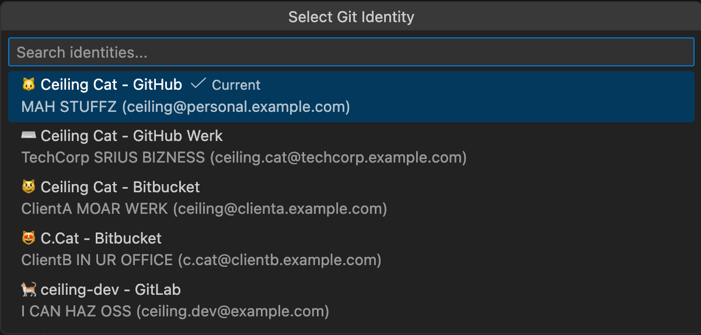

# Git ID Switcher 🐱

> **I CAN HAZ MULTIPLE IDENTITIEZ?** YES U CAN!

---

<table>
  <tr>
    <td align="center" valign="top" width="150">
      
    </td>
    <td>
      SWITCH BETWEN UR MULTIPLE GIT IDENTITIEZ WIF WUN CLIK. MANAGE LOTZ OF GITHUB ACCOUNTZ, SSH KEYZ, GPG SININ, AN <b>AUTOMAGICALLY APPLY IDENTITY 2 GIT SUBMODULEZ</b>. KTHXBAI!
      <br><br>
      <a href="https://marketplace.visualstudio.com/items?itemName=nullvariant.git-id-switcher"></a>
      <a href="https://open-vsx.org/extension/nullvariant/git-id-switcher"></a>
      <a href="https://opensource.org/licenses/MIT"></a>
      <br>
      🌐 LANGUAGEZ: <a href="../../../README.md">🇺🇸</a> <a href="../ja/README.md">🇯🇵</a> <a href="../zh-CN/README.md">🇨🇳</a> <a href="../zh-TW/README.md">🇹🇼</a> <a href="../ko/README.md">🇰🇷</a> <a href="../de/README.md">🇩🇪</a> <a href="../fr/README.md">🇫🇷</a> <a href="../es/README.md">🇪🇸</a> ... <a href="../../LANGUAGES.md">+20 MOAR</a>
    </td>
  </tr>
</table>

<br>



## FEATUREZ 😺

- **WUN-CLIK IDENTITY SWITCH**: CHANGE UR GIT USER.NAME AN USER.EMAIL LIEK SPEEDEE CAT
- **SSH KEY MANAGEMINT**: AUTOMAGICALLY SWITCH UR SSH KEYZ IN SSH-AGENT
- **GPG SININ SUPPORT**: CONFIGURE UR GPG KEY 4 COMMIT SININ (OPSHUNUL)
- **SUBMODULE SUPPORT**: AUTOMAGICALLY PROPAGATE UR IDENTITY 2 GIT SUBMODULEZ
- **STATUS BAR**: ALWAYZ C UR CURRENT IDENTITY AT A GLANS
- **RICH TOOLTIPZ**: DETAILD IDENTITY INFO WIF DESCRIPSHUN AN SSH HOST
- **CROSS-PLATFORM**: WERKZ ON MACOS, LINUX, AN WINDOWZ - ALL TEH BOXEZ!
- **LOCALIZD**: SUPPORTZ 17 LANGUAGEZ PLUS LOLCAT!

## 🚀 Y DIS EXTENSHUN?

WILE MANY GIT IDENTITY SWITCHERZ EXIST, **GIT ID SWITCHER** SOLVEZ TEH HARD PROBLEMZ:

1. **SUBMODULEZ NITEMARE**: WERKIN WIF REPOSITORIEZ DAT HAZ SUBMODULEZ USUALLY REQUIREZ SETTIN `git config user.name` MANUALLY 4 *EACH* SUBMODULE. DIS EXTENSHUN HANDLEZ IT BY RECURSIVELY APPLYIN UR IDENTITY 2 ALL ACTIVE SUBMODULEZ. SO SMRT!
2. **SSH & GPG HANDLIN**: IT DONT JUS CHANGE UR NAEM; IT SWAPZ UR SSH KEYZ IN TEH AGENT AN CONFIGUREZ GPG SININ SO U NEVR COMMIT WIF TEH RONG SIGNATUR. NO MOAR FAILZ!

## 🌏 BOUT MULTILINGUAL SUPPORT

> **I VALUEZ TEH EXISTENS OF MINORITIEZ.**
> I DONT WANT 2 DISCARD DEM JUS CUZ DEY R SMOL IN NUMBR.
> EVEN IF TRANSLASHUNZ ARNT PERFICT, I HOEP U CAN FEEL OUR INTENT 2 SHOW RESPEKT!

---

## QUICK START 🐾

### STEP 1: PREPAR UR SSH KEYZ

```bash
# CEILING CAT (WATCHIN U CODE)
ssh-keygen -t ed25519 -C "ceiling@cat.example.com" -f ~/.ssh/id_ed25519_ceiling

# KEYBOARD CAT (MAKIN TEH CODEZ)
ssh-keygen -t ed25519 -C "keyboard@cat.example.com" -f ~/.ssh/id_ed25519_keyboard
```

### STEP 2: CONFIGUR SSH

EDIT `~/.ssh/config`:

```ssh-config
# CEILING CAT ACCOUNT
Host github.com
    HostName github.com
    User git
    IdentityFile ~/.ssh/id_ed25519_ceiling
    IdentitiesOnly yes

# KEYBOARD CAT ACCOUNT
Host github-keyboard
    HostName github.com
    User git
    IdentityFile ~/.ssh/id_ed25519_keyboard
    IdentitiesOnly yes
```

### STEP 3: CONFIGUR TEH EXTENSHUN

```json
{
  "gitIdSwitcher.identities": [
    {
      "id": "ceiling-cat",
      "icon": "😼",
      "name": "Ceiling Cat",
      "email": "ceiling@cat.example.com",
      "description": "WATCHIN U CODE",
      "sshKeyPath": "~/.ssh/id_ed25519_ceiling"
    },
    {
      "id": "keyboard-cat",
      "icon": "🎹",
      "name": "Keyboard Cat",
      "email": "keyboard@cat.example.com",
      "description": "PLAY HIM OFF",
      "sshKeyPath": "~/.ssh/id_ed25519_keyboard",
      "sshHost": "github-keyboard"
    },
    {
      "id": "grumpy-cat",
      "icon": "😾",
      "name": "Grumpy Cat",
      "email": "grumpy@cat.example.com",
      "description": "I HAD FUN ONCE. IT WUZ AWFUL."
    },
    {
      "id": "nyan",
      "icon": "🌈",
      "name": "Nyan Cat",
      "email": "nyan@cat.example.com",
      "description": "NYANYANYANYANYA"
    }
  ],
  "gitIdSwitcher.defaultIdentity": "ceiling-cat",
  "gitIdSwitcher.autoSwitchSshKey": true,
  "gitIdSwitcher.applyToSubmodules": true
}
```

### STEP 4: DO TEH THING!

1. CLIK TEH IDENTITY ICON IN TEH STATUS BAR
2. PIK UR IDENTITY
3. INVISIBLE IDENTITY SWITCH! U CANT C IT BUT ITS DERE!

---

## FAMOUS CAT MEMEZ EXPLANED 📚

| CAT | MEME ORIGIN | Y FAMOUS |
|-----|-------------|----------|
| 😼 Ceiling Cat | 2006 image macro | "Ceiling Cat iz watchin u" - teh original all-seeing cat |
| 🎹 Keyboard Cat | 1984 video, viral 2007 | Played ppl off wen dey fail |
| 😾 Grumpy Cat | Tardar Sauce, 2012 | "I had fun once. It was awful." RIP 2019 |
| 🌈 Nyan Cat | 2011 YouTube video | Pop-Tart cat flyin thru space wif rainbowz |

---

## COMMANDZ

| COMMAND                         | WAT IT DOEZ                    |
| ------------------------------- | ------------------------------ |
| `Git ID: Select Identity`       | OPEN TEH IDENTITY PIKR         |
| `Git ID: Show Current Identity` | SHOW CURRENT IDENTITY INFO     |

---

## CONTRIBUTIN

WE WELCOM CONTRIBUSHUNZ! C [CONTRIBUTING.md](../../CONTRIBUTING.md). DO WANT!

## LICENS

MIT LICENS - C [LICENSE](../../LICENSE). FREE LIEK FREDUM!

## CREDITZ

MADE BY [Null;Variant](https://github.com/nullvariant)

---

🐱 **KTHXBAI!** 🐱
