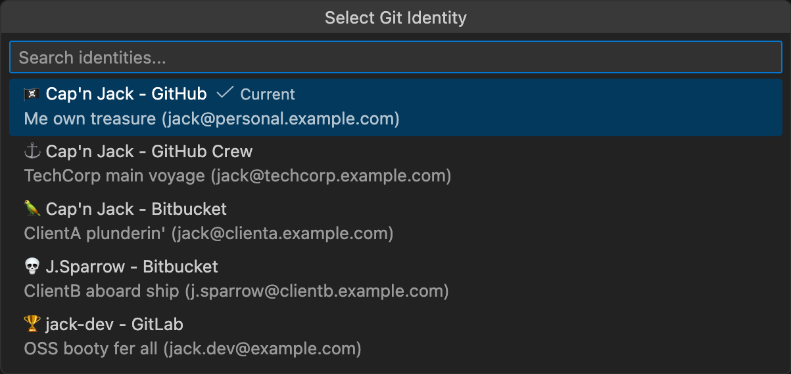

# Git ID Switcher 🏴‍☠️

> **Ahoy, matey!** This here be a translation fer all ye scallywags who speak the noble tongue o' the Seven Seas!

---

<table>
  <tr>
    <td align="center" width="150">
      
    </td>
    <td>
      Switch between yer multiple Git identities with a single click o' yer hook! Manage multiple GitHub accounts, SSH keys, GPG signin', and <b>automatically apply yer identity to all Git Submodules</b>, arrr!
      <br><br>
      <a href="https://marketplace.visualstudio.com/items?itemName=nullvariant.git-id-switcher"></a>
      <a href="https://open-vsx.org/extension/nullvariant/git-id-switcher"></a>
      <a href="https://opensource.org/licenses/MIT"></a>
      <br>
      🌐 Tongues: <a href="../../../README.md">🇺🇸</a> <a href="../ja/README.md">🇯🇵</a> <a href="../zh-CN/README.md">🇨🇳</a> <a href="../zh-TW/README.md">🇹🇼</a> <a href="../ko/README.md">🇰🇷</a> <a href="../de/README.md">🇩🇪</a> <a href="../fr/README.md">🇫🇷</a> <a href="../es/README.md">🇪🇸</a> ... <a href="../../LANGUAGES.md">+20 more</a>
    </td>
  </tr>
</table>

<br>



## Features, Ye Scurvy Dog!

- **One-Click Identity Switch**: Change yer Git user.name and user.email faster than ye can say "shiver me timbers!"
- **SSH Key Management**: Automatically switch yer SSH keys in ssh-agent, like changin' sails in a storm
- **GPG Signin' Support**: Configure yer GPG key fer commit signin' (optional, but a true pirate always signs their plunder)
- **Submodule Support**: Automatically propagate yer identity to all Git submodules in yer fleet
- **Status Bar Integration**: Always see yer current identity at a glance from the crow's nest
- **Rich Tooltips**: Detailed identity info with description and SSH host
- **Cross-Platform**: Works on macOS, Linux, and Windows - every port in the digital sea!
- **Localized**: Supports 17 languages, plus Pirate speak, arrr!

## 🚀 Why This Extension, Ye Ask?

While many Git identity switchers sail the seven seas, **Git ID Switcher** solves the treacherous problems that others ignore:

1. **Submodules Be a Nightmare**: Workin' with repositories that have submodules usually requires settin' `git config user.name` manually fer *each* submodule. This extension handles it elegantly by recursively applyin' yer identity to all active submodules in yer fleet.
2. **SSH & GPG Handlin'**: It don't just change yer name; it swaps yer SSH keys in the agent and configures GPG signin' so ye never commit with the wrong signature, lest ye walk the plank!

## 🌏 A Note on Multilingual Support

> **I value the existence o' minorities, even pirates!**
> I don't want to discard 'em just because they be small in number.
> Even if translations ain't perfect, I hope ye can feel our intent to show respect fer all tongues!

---

## Quick Start, Ye Landlubber!

### Step 1: Prepare Yer SSH Keys

```bash
# Captain's personal account
ssh-keygen -t ed25519 -C "blackbeard@personal.example.com" -f ~/.ssh/id_ed25519_captain

# Merchant vessel account (fer legitimate business, arrr)
ssh-keygen -t ed25519 -C "blackbeard@merchant.example.com" -f ~/.ssh/id_ed25519_merchant
```

### Step 2: Configure Yer SSH

Edit `~/.ssh/config`:

```ssh-config
# Captain's Personal Account (default)
Host github.com
    HostName github.com
    User git
    IdentityFile ~/.ssh/id_ed25519_captain
    IdentitiesOnly yes

# Merchant Account
Host github-merchant
    HostName github.com
    User git
    IdentityFile ~/.ssh/id_ed25519_merchant
    IdentitiesOnly yes
```

### Step 3: Configure the Extension

```json
{
  "gitIdSwitcher.identities": [
    {
      "id": "captain",
      "icon": "🏴‍☠️",
      "name": "Captain Blackbeard",
      "email": "blackbeard@personal.example.com",
      "description": "Plunderin' personal projects",
      "sshKeyPath": "~/.ssh/id_ed25519_captain"
    },
    {
      "id": "merchant",
      "icon": "⚓",
      "name": "Edward Teach",
      "email": "blackbeard@merchant.example.com",
      "description": "Legitimate merchant business",
      "sshKeyPath": "~/.ssh/id_ed25519_merchant",
      "sshHost": "github-merchant"
    },
    {
      "id": "navy-spy",
      "icon": "🎭",
      "name": "Lieutenant Smith",
      "email": "smith@navy.example.com",
      "description": "Undercover operations"
    },
    {
      "id": "tavern",
      "icon": "🍺",
      "name": "Jolly Roger",
      "email": "jolly@tavern.example.com",
      "description": "Tavern side projects"
    }
  ],
  "gitIdSwitcher.defaultIdentity": "captain",
  "gitIdSwitcher.autoSwitchSshKey": true,
  "gitIdSwitcher.applyToSubmodules": true
}
```

### Step 4: Set Sail!

1. Click the identity icon in the status bar (bottom right, near the anchor)
2. Pick yer identity
3. Arrr! Yer Git config and SSH keys be switched!

---

## Commands

| Command                         | What It Does                        |
| ------------------------------- | ----------------------------------- |
| `Git ID: Select Identity`       | Open the identity picker, ye scurvy dog |
| `Git ID: Show Current Identity` | Show current identity info          |

---

## Contributing

We welcome contributions from all pirates! See [CONTRIBUTING.md](../../CONTRIBUTING.md).

## License

MIT License - See [LICENSE](../../LICENSE). Share the plunder fairly!

## Credits

Crafted by [Null;Variant](https://github.com/nullvariant)

---

🏴‍☠️ **Fair winds and following seas, matey!** 🏴‍☠️
