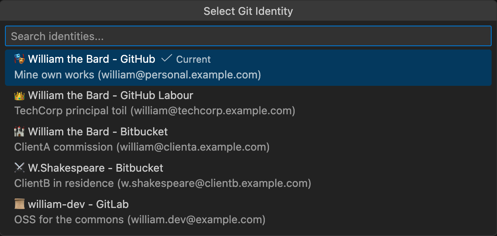

# Git ID Switcher 🎭

> *"To switch, or not to switch—that is the question."*
> — A Developer, pondering their Git identity

---

<table>
  <tr>
    <td align="center" valign="top" width="150">
      
    </td>
    <td>
      Switcheth betwixt thy multiple Git identities with but a single click. Manageth multiple GitHub accounts, SSH keys, GPG signing, and <b>automatically applyeth thine identity unto Git Submodules</b>.
      <br><br>
      <a href="https://marketplace.visualstudio.com/items?itemName=nullvariant.git-id-switcher"></a>
      <a href="https://open-vsx.org/extension/nullvariant/git-id-switcher"></a>
      <a href="https://opensource.org/licenses/MIT"></a>
      <br>
      🌐 Tongues: <a href="../../../README.md">🇺🇸</a> <a href="../ja/README.md">🇯🇵</a> <a href="../zh-CN/README.md">🇨🇳</a> <a href="../zh-TW/README.md">🇹🇼</a> <a href="../ko/README.md">🇰🇷</a> <a href="../de/README.md">🇩🇪</a> <a href="../fr/README.md">🇫🇷</a> <a href="../es/README.md">🇪🇸</a> <a href="../pt-BR/README.md">🇧🇷</a> <a href="../it/README.md">🇮🇹</a> <a href="../ru/README.md">🇷🇺</a> <a href="../pl/README.md">🇵🇱</a> <a href="../tr/README.md">🇹🇷</a> <a href="../cs/README.md">🇨🇿</a> <a href="../hu/README.md">🇭🇺</a> <a href="../bg/README.md">🇧🇬</a> <a href="../uk/README.md">🇺🇦</a> ... <a href="../../LANGUAGES.md">+8 more</a>
    </td>
  </tr>
</table>

<br>



## Features Most Noble

- **One-Click Identity Switch**: Changeth thy Git user.name and user.email in the twinkling of an eye
- **SSH Key Management**: Automatically switcheth thy SSH keys within the ssh-agent
- **GPG Signing Support**: Configureth thy GPG key for the signing of commits (optional, yet most wise)
- **Submodule Support**: Automatically propagateth thine identity unto all Git submodules
- **Status Bar Integration**: Ever shall thy current identity be visible at a glance
- **Rich Tooltips**: Detailed identity information with description and SSH host
- **Cross-Platform**: Worketh upon macOS, Linux, and Windows—all the stages of the world!
- **Localized**: Supporteth 17 tongues of the realm

## 🚀 Wherefore This Extension?

Whilst many Git identity switchers doth exist upon this mortal coil, **Git ID Switcher** solveth the vexing problems that others do ignore:

1. **The Submodule's Lament**: When working with repositories containing submodules, one must oft set `git config user.name` by hand for *each* submodule—a most tedious affair! This extension handleth it with grace, recursively applying thine identity unto all active submodules.
2. **SSH & GPG Handling**: It doth not merely change thy name; it swappeth thy SSH keys in the agent and configureth GPG signing, that thou might never commit with the wrong signature!

## 🌏 A Soliloquy on Multilingual Support

> *"What's in a language? That which we call a tongue*
> *By any other name would speak as sweet."*
>
> **I do value the existence of minorities.**
> I wish not to discard them merely because they be few in number.
> Even if translations be not perfect, I hope thou canst feel our intent to show respect.

---

## Quick Start, Good Sir or Madam

A typical arrangement for the management of one's personal account and enterprise account (Enterprise Managed User). The most essential preparation for any performance!

### Act I: Prepare Thy SSH Keys

```bash
# For the tragedy of personal projects
ssh-keygen -t ed25519 -C "hamlet@elsinore.example.com" -f ~/.ssh/id_ed25519_hamlet

# For the comedy of work
ssh-keygen -t ed25519 -C "macbeth@glamis.example.com" -f ~/.ssh/id_ed25519_macbeth
```

Upon generating thy keys, register the public keys (`.pub`) unto each service (GitHub, GitLab, Bitbucket, and so forth). This is most required!

### Act II: Configure Thy SSH

Edit `~/.ssh/config`:

```ssh-config
# The Prince of Denmark's Account (GitHub - default)
Host github.com
    HostName github.com
    User git
    IdentityFile ~/.ssh/id_ed25519_hamlet
    IdentitiesOnly yes

# The Thane of Glamis's Account (GitHub)
Host github-macbeth
    HostName github.com
    User git
    IdentityFile ~/.ssh/id_ed25519_macbeth
    IdentitiesOnly yes

# Juliet's Account (Bitbucket)
Host bitbucket.org
    HostName bitbucket.org
    User git
    IdentityFile ~/.ssh/id_ed25519_juliet
    IdentitiesOnly yes
```

### Act III: Configure the Extension

Open **Extension Settings** and configure thine identities within `gitIdSwitcher.identities`:

```json
{
  "gitIdSwitcher.identities": [
    {
      "id": "hamlet",
      "icon": "💀",
      "name": "Hamlet, Prince of Denmark",
      "email": "hamlet@elsinore.example.com",
      "description": "To code, or not to code",
      "sshKeyPath": "~/.ssh/id_ed25519_hamlet",
      "service": "github"
    },
    {
      "id": "macbeth",
      "icon": "🗡️",
      "name": "Macbeth, Thane of Glamis",
      "email": "macbeth@glamis.example.com",
      "description": "Is this a merge conflict I see before me?",
      "sshKeyPath": "~/.ssh/id_ed25519_macbeth",
      "sshHost": "github-macbeth",
      "service": "github"
    },
    {
      "id": "romeo",
      "icon": "❤️",
      "name": "Romeo Montague",
      "email": "romeo@verona.example.com",
      "description": "But soft, what code through yonder window breaks?",
      "service": "gitlab"
    },
    {
      "id": "juliet",
      "icon": "🌹",
      "name": "Juliet Capulet",
      "email": "juliet@verona.example.com",
      "description": "O Git, Git! Wherefore art thou Git?",
      "service": "bitbucket"
    }
  ],
  "gitIdSwitcher.defaultIdentity": "hamlet",
  "gitIdSwitcher.autoSwitchSshKey": true,
  "gitIdSwitcher.applyToSubmodules": true
}
```

### Act IV: The Performance

1. Click upon the identity icon in the status bar
2. Select thine identity
3. 'Tis done! Thy Git config and SSH keys have been switched!

---

## Optional: GPG Signing

If thou wouldst sign thy commits with GPG (as a noble lord doth seal their letters):

### Scene I: Find Thy GPG Key ID

```bash
gpg --list-secret-keys --keyid-format SHORT
```

Example output:

```text
sec   ed25519/ABCD1234 2024-01-01 [SC]
      ...
uid         [ultimate] Hamlet, Prince of Denmark <hamlet@elsinore.example.com>
```

Thy key ID is `ABCD1234`. Remember it well!

### Scene II: Add GPG Key to Thine Identity

```json
{
  "gitIdSwitcher.identities": [
    {
      "id": "hamlet",
      "icon": "💀",
      "name": "Hamlet, Prince of Denmark",
      "service": "GitHub",
      "email": "hamlet@elsinore.example.com",
      "description": "To code, or not to code",
      "sshKeyPath": "~/.ssh/id_ed25519_hamlet",
      "gpgKeyId": "ABCD1234"
    }
  ]
}
```

When thou switchest to this identity, the extension doth set:

- `git config user.signingkey ABCD1234`
- `git config commit.gpgsign true`

Now thy commits bear the royal seal!

---

## Full Example: Four Accounts with SSH + GPG (A Grand Ensemble)

All the elements combined! Here doth follow the complete example:

### SSH Config (`~/.ssh/config`)

```ssh-config
# Hamlet's Account (default)
Host github.com
    HostName github.com
    User git
    IdentityFile ~/.ssh/id_ed25519_hamlet
    IdentitiesOnly yes

# Macbeth's Account (Company EMU)
Host github-macbeth
    HostName github.com
    User git
    IdentityFile ~/.ssh/id_ed25519_macbeth
    IdentitiesOnly yes

# Juliet's Account (Bitbucket)
Host bitbucket.org
    HostName bitbucket.org
    User git
    IdentityFile ~/.ssh/id_ed25519_juliet
    IdentitiesOnly yes
```

### Extension Config

```json
{
  "gitIdSwitcher.identities": [
    {
      "id": "hamlet",
      "icon": "💀",
      "name": "Hamlet, Prince of Denmark",
      "service": "GitHub",
      "email": "hamlet@elsinore.example.com",
      "description": "Personal - To code, or not to code",
      "sshKeyPath": "~/.ssh/id_ed25519_hamlet",
      "gpgKeyId": "HAMLET01"
    },
    {
      "id": "macbeth",
      "icon": "🗡️",
      "name": "Macbeth, Thane of Glamis",
      "service": "GitHub Company",
      "email": "macbeth@company_hamlet.example.com",
      "description": "Company (EMU) - Thane of commits",
      "sshKeyPath": "~/.ssh/id_ed25519_macbeth",
      "sshHost": "github-macbeth",
      "gpgKeyId": "MACBETH1"
    },
    {
      "id": "juliet",
      "icon": "🪣",
      "name": "Juliet Capulet",
      "service": "Bitbucket",
      "email": "juliet@verona.example.com",
      "description": "Bitbucket - O happy dagger",
      "sshKeyPath": "~/.ssh/id_ed25519_juliet",
      "sshHost": "bitbucket.org"
    },
    {
      "id": "romeo",
      "icon": "❤️",
      "name": "Romeo Montague",
      "service": "GitLab",
      "email": "romeo@freelance.example.com",
      "description": "Freelance - Wherefore art thou, code?"
    }
  ],
  "gitIdSwitcher.defaultIdentity": "hamlet",
  "gitIdSwitcher.autoSwitchSshKey": true,
  "gitIdSwitcher.applyToSubmodules": true
}
```

Note: The final identity (`romeo`) hath no SSH. Thou canst use this for switching merely the Git config (such as different committer information upon the same account).

---

## Identity Properties

| Property | Required | Description |
|----------|----------|-------------|
| `id` | ✅ | A unique identifier for this identity |
| `name` | ✅ | Git `user.name` (appeareth in commits) |
| `email` | ✅ | Git `user.email` |
| `icon` | ❌ | A single emoji for the status bar. EMOJI ONLY, no text! |
| `description` | ❌ | Description (showeth in dropdown) |
| `sshKeyPath` | ❌ | Path to SSH private key |
| `sshHost` | ❌ | SSH host alias (`Host` in ~/.ssh/config) |
| `gpgKeyId` | ❌ | GPG key ID for commit signing |
| `service` | ❌ | Git service: `github`, `gitlab`, `bitbucket`, `other` |

---

## Commands

| Command                         | Description                           |
| ------------------------------- | ------------------------------------- |
| `Git ID: Select Identity`       | Open the identity picker              |
| `Git ID: Show Current Identity` | Reveal thy current identity           |

---

## Settings

| Setting | Default | Description |
|---------|---------|-------------|
| `gitIdSwitcher.identities` | `[]` | The list of identities in thy troupe |
| `gitIdSwitcher.defaultIdentity` | `""` | Default identity ID |
| `gitIdSwitcher.autoSwitchSshKey` | `true` | Automatically switch SSH keys |
| `gitIdSwitcher.applyToSubmodules` | `true` | Apply identity unto submodules |
| `gitIdSwitcher.includeIconInGitConfig` | `false` | Include emoji in Git config (see below) |

---

## Display Limitations

- **`icon` property**: A single emoji only! No text such as "💀 Hamlet". Simply "💀".
- **`includeIconInGitConfig`**: When disabled (default), emoji doth not appear in Git config user.name.

---

## `includeIconInGitConfig` Setting

This setting doth control whether emoji be added to Git `user.name`.

| Setting | Behavior |
|---------|----------|
| `false` (default) | Git config: `user.name = Hamlet, Prince of Denmark` (no emoji in config) |
| `true` | Git config: `user.name = 💀 Hamlet, Prince of Denmark` (emoji in config) |

> **Note**: The emoji doth always appear in the status bar regardless of this setting! This affecteth only the Git config.

---

## Git Config Layer Structure

### How Git Config Worketh

Git config hath three layers, like acts in a play:

```text
SYSTEM (/etc/gitconfig)
   ↓ overridden by
GLOBAL (~/.gitconfig)
   ↓ overridden by
LOCAL (.git/config)  ← This extension writeth here with `--local`
```

### Submodule Propagation

Local settings art per-repository, thus submodules inherit them not automatically.
'Tis why this extension provideth the propagation feature (see "Advanced: Submodule Support" section).

---

## Advanced: Submodule Support

When thy repositories contain Git submodules, identity management becometh most vexing. When thou dost commit within a submodule, Git useth that submodule's local config, and if none be set, it falleth back to global config (the wrong email address! A tragedy most foul!).

**Git ID Switcher** automatically detecteth submodules and applieth thy selected identity.

```json
{
  "gitIdSwitcher.applyToSubmodules": true,
  "gitIdSwitcher.submoduleDepth": 1
}
```

- `applyToSubmodules`: Enable or disable this feature
- `submoduleDepth`: How deep shall we descend?
  - `1`: Only direct submodules (most common)
  - `2+`: Nested submodules (submodules within submodules—a play within a play!)

Thus, whether thou dost commit in the main repository or in a vendor library, thine identity remaineth ever correct. No more embarrassing commits with the wrong signature!

---

## Troubleshooting

### "Name field is required" Error

If thou dost encounter this error, examine thy settings:

```json
{
  "gitIdSwitcher.identities": [
    {
      "id": "hamlet",
      "name": "Hamlet, Prince of Denmark",  // ← This is required!
      "email": "hamlet@elsinore.example.com"  // ← This also!
    }
  ]
}
```

Both `name` and `email` are required. The play cannot proceed without them!

### New Settings Appear Not

If new settings such as `service` or `includeIconInGitConfig` appear not:

1. **Reload Window**: Press `Cmd+Shift+P` (Mac) or `Ctrl+Shift+P` (Windows/Linux)
2. **Type**: "Developer: Reload Window"
3. **Press Enter**

VS Code doth cache setting schemas. A reload shall remedy this!

### Settings Sync Conflicts

If thou usest VS Code Settings Sync and hast different identities upon different machines:

1. **Option A**: Disable sync for this extension's settings
2. **Option B**: Use the same identities upon all machines
3. **Option C**: Use workspace settings (`.vscode/settings.json`) instead

> **Tip**: Workspace settings are per-project and sync not. Most suitable for different identities!

---

## Contributing

We welcome contributions from all players upon this stage! See [CONTRIBUTING.md](../../CONTRIBUTING.md).

## License

MIT License - See [LICENSE](../../LICENSE).

## Credits

Crafted by [Null;Variant](https://github.com/nullvariant)

---

🎭 *"All the world's a stage, and all the devs merely players."* 🎭
